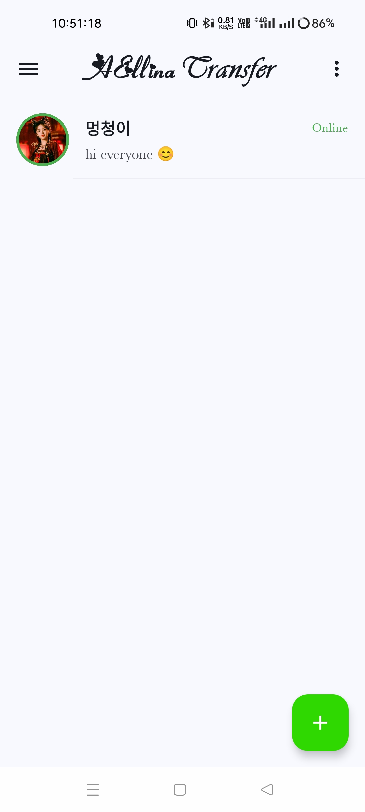
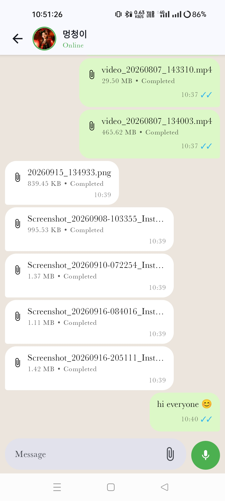
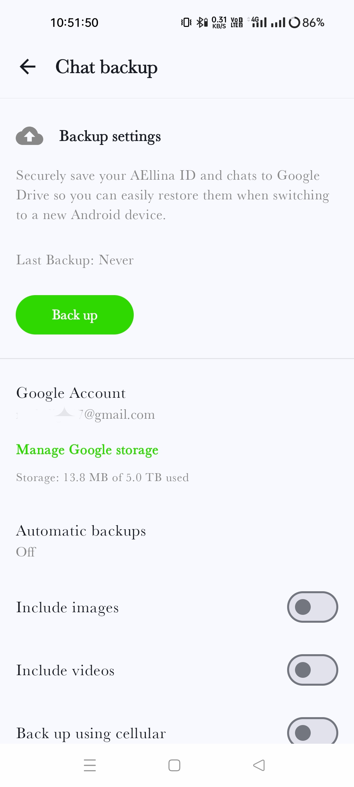
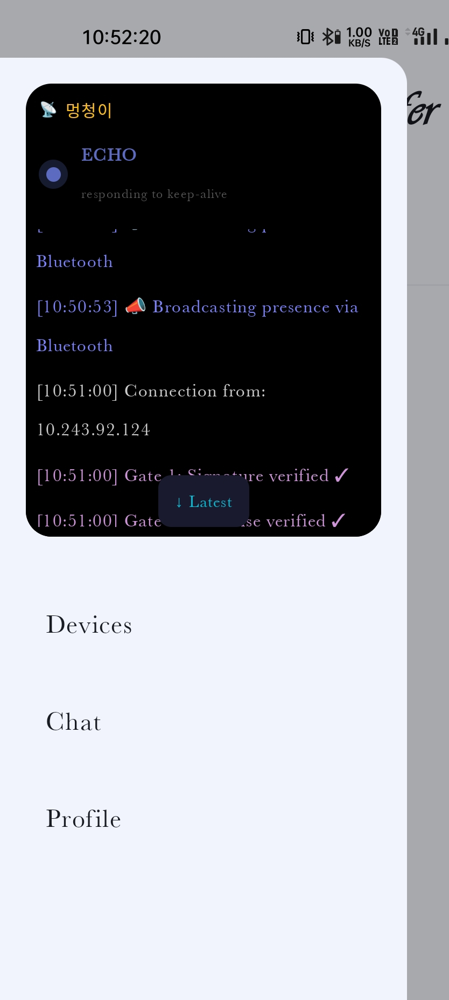
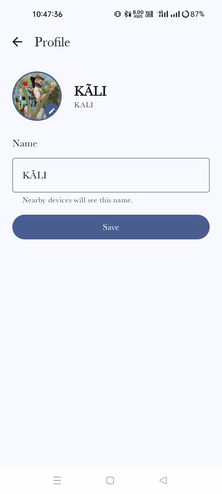
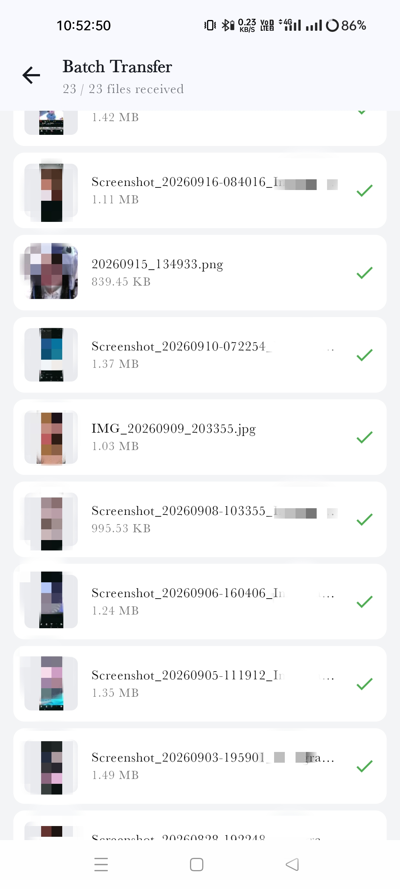

<h1 align="center">
   
  AEllina Transfer (AEllinaT)
</h1>

  <strong>A 100% Offline, Privacy-First P2P File Transfer & Chat App for Android.</strong> 
  <i>Note: "AEllina Transfer" is officially released under the short name <b>AEllinaT</b>.</i>

## ✨ Features
* **🚀 Completely Offline:** Transfer files and chat without any active internet connection using Wi-Fi Direct/Hotspot.
* **🔒 Privacy First:** No tracking, no analytics, no external servers. Your data stays on your device.
* **⚡ High-Speed Transfer:** Built on raw TCP connections for maximum speed.
* **☁️ E2E Encrypted Backup:** Backup your data to your personal Google Drive with military-grade End-to-End Encryption. Google can't read your backups, and neither can we.
* **📱 Clean UI:** Material Design 3 and Jetpack Compose.
## ⚡ Transfer Speeds & Network Performance
File transfer speeds depend entirely on your device's hardware and your Wi-Fi network's frequency band. 

* **5 GHz Wi-Fi / Hotspot:** Ultra-fast speeds up to **40+ MB/s**.
* **2.4 GHz Wi-Fi (Standard):** Average speeds around **2-3 MB/s** (due to shared antenna interference with Bluetooth).
* **💡 Pro-Tip for 2.4 GHz Users:** To boost your transfer speed to **6-8 MB/s**, turn **OFF** Bluetooth and Location *after* the devices are successfully connected. *(Note: If your connection drops, you must turn Bluetooth and Location back ON to discover devices again).*

## 📖 Quick Start Guide (How to Use)
Follow these simple steps to start chatting and sharing files:

**1. Preparation**
* Ensure both devices are on the **same Wi-Fi network** (or one device is connected to the other's Mobile Hotspot).
* Turn **ON** Bluetooth and Location on both devices. (Required by Android for nearby device discovery).

**2. First-Time Setup**
* Open the app. If you are a new user and don't have a Google Drive backup, simply tap **Skip** on the startup screen.

**3. Connecting Devices**
* Navigate to the **Devices Screen**.
* You will see nearby devices listed. Tap on the device you want to connect to.
* The other device will receive a prompt. Tap **Approve** to establish a secure connection.

**4. Transfer & Chat**
* Once connected, click the **`+` (Plus) icon** to start chatting or transferring files securely!
  
## 📸 Screenshots

   &nbsp;&nbsp;
   &nbsp;&nbsp;
  

   &nbsp;&nbsp;
   &nbsp;&nbsp;
  

## 📥 Download
[**Download Latest APK Here**](https://github.com/masterkalii7/AEllinaT/releases/latest)

## 🛡️ Privacy Policy
Read our full privacy policy [here](https://masterkalii7.github.io/AEllinaT/privacy.html).
